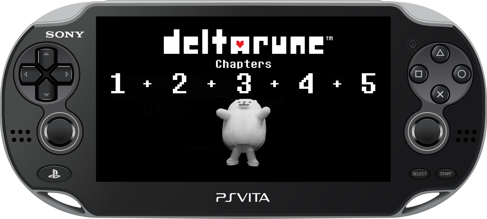
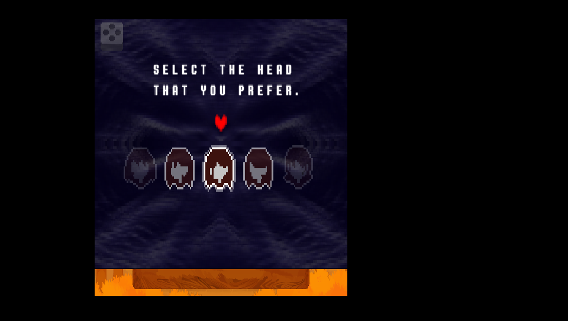
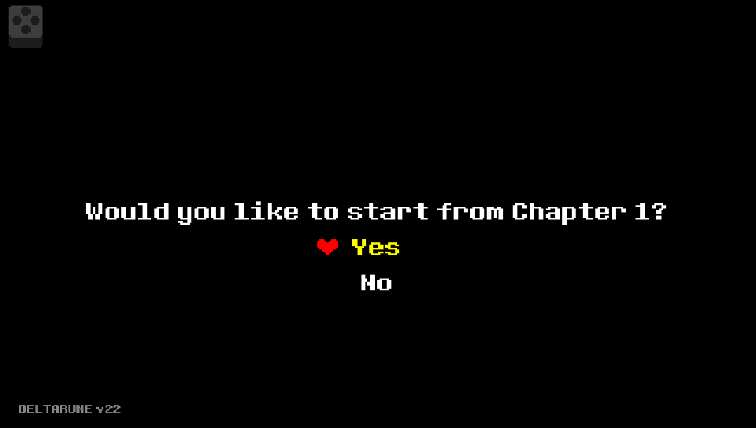

<p align="center">
  
</p>

---

<p align="center">
  
</p>

Port não oficial de **DELTARUNE Chapters 1–5** para PlayStation Vita.

A partir da v0.36, o projeto passou a executar diretamente os dados GameMaker da versão Windows/Steam por meio de uma adaptação do [Butterscotch](https://github.com/ButterscotchRunner/Butterscotch), com renderização pelo [VitaGL](https://github.com/Rinnegatamante/vitaGL). A versão Android não é mais a fonte principal dos dados.

> Este repositório e suas releases não incluem arquivos comerciais de DELTARUNE. Compre e obtenha o jogo oficial em [deltarune.com](https://deltarune.com/).


## Release status

<p align="center">
  
  &nbsp;
  
  &nbsp;
  
</p>

A versão atual é a **v0.40**. Os cinco capítulos inicializam e são jogáveis em hardware real, embora algumas cenas e efeitos ainda estejam em validação.

---

##  O que já funciona

- seletor e troca dos cinco capítulos;
- retorno ao Chapter Select pelo menu do jogo;
- leitura direta dos arquivos Windows/Steam;
- renderer VitaGL adaptado ao backend legado do Butterscotch;
- controles físicos do Vita;
- controles touch opcionais;
- menu Game Settings em inglês e português;
- volumes separados para música e efeitos;
- posição e zoom da tela configuráveis;
- bordas da versão de console selecionadas por capítulo;
- carregamento sob demanda e cache de texturas para os capítulos maiores;
- saves, mods por capítulo e preparação de PT-BR;
- logs persistentes para diagnóstico.
---

##  Mudança de direção

O trabalho começou estudando ports Android e o carregamento por YoYo Loader/SoLoader. Essa etapa permitiu entender a divisão dos capítulos, os arquivos externos, a inicialização do runner e os controles touch.

Depois dos primeiros testes com Butterscotch e VitaGL, o port passou a carregar os dados oficiais da versão Windows. Isso remove a dependência do APK e evita manter os problemas específicos do runner Android.

O fluxo atual é:

```text
Arquivos oficiais PC/Steam
        ↓
Preparação dos dados por capítulo
        ↓
Butterscotch adaptado ao Vita
        ↓
VitaGL + OpenAL + controles Vita
```

## Guia de instalação

To install the game correctly, follow these steps:

- Install [kubridge](https://github.com/TheOfficialFloW/kubridge/releases/) and [FdFix](https://github.com/TheOfficialFloW/FdFix/releases/) by copying `kubridge.skprx` and `fd_fix.skprx` to your taiHEN plugins folder (usually `ux0:tai`) and adding these entries to `config.txt` under `*KERNEL`:

  ```text
  *KERNEL
  ux0:tai/kubridge.skprx
  ux0:tai/fd_fix.skprx
  ```

  **Note:** Do not install `fd_fix.skprx` if you are using the rePatch plugin.

- **Optional:** Install [PSVshell](https://github.com/Electry/PSVshell/releases) to overclock your device.
- Install `libshacccg.suprx`, if it is not already installed, by following [this guide](https://samilops2.gitbook.io/vita-troubleshooting-guide/shader-compiler/extract-libshacccg.suprx).
- Legally obtain o jogo oficial em [deltarune.com](https://deltarune.com/).

### HOW TO APPLY THE PATCH:

O patcher para preparar os arquivos a partir de uma instalação oficial de PC/Steam será disponibilizado em breve.

Quando publicado, o processo será:

1. Comprar e instalar [DELTARUNE para PC](https://deltarune.com/).
2. Baixar o patcher e o VPK na página de [Releases](https://github.com/WolffsRoom/DeltaruneVita/releases/latest).
3. Executar o patcher apontando para a instalação oficial.
4. Instalar `Deltarune.vpk` pelo VitaShell.
5. Copiar a pasta gerada para `ux0:data/deltarune/deltarunevita/`.

Os fundos de console são distribuídos [separadamente](https://www.spriters-resource.com/pc_computer/deltarune/asset/115841/). 
A pasta `borders` deve ficar em:

```text
ux0:data/deltarune/deltarunevita/borders/
```

---

## Controles

<table>
  <thead>
    <tr><th>Controle</th><th>Ação</th><th>Controle</th><th>Ação</th></tr>
  </thead>
  <tbody>
    <tr>
      <td>   / Analógico esquerdo</td>
      <td>Movimento</td>
      <td></td>
      <td>Confirmar / interagir</td>
    </tr>
    <tr>
      <td> </td>
      <td>Cancelar / voltar</td>
      <td></td>
      <td>Menu do jogo</td>
    </tr>
    <tr>
      <td><strong>SELECT</strong></td>
      <td>Abrir Game Settings</td>
      <td> </td>
      <td>Navegar entre categorias</td>
    </tr>
    <tr>
      <td></td>
      <td>Controles virtuais</td>
      <td>Analógicos em Adjust Screen</td>
      <td>Esquerdo move; direito ajusta o zoom</td>
    </tr>
  </tbody>
</table>

## Screenshots

<p align="center">
  
  
  
</p>

## Official Vídeo 

<div align="center">
  <a href="https://www.youtube.com/watch?v=yDzgiGdekas" target="_blank" title="Assistir à demonstração no YouTube">
    
  </a>
  <br>
  <sup><em>Clique na imagem para assistir ao vídeo completo no YouTube</em></sup>
</div>

---

### Build Instructions 

Coloque uma instalação legítima em `SteamFiles/DELTARUNE` e execute:

```powershell
powershell -ExecutionPolicy Bypass -File .\scripts\prepare-windows-data.ps1
```

Os dados preparados serão criados em:

```text
data/prepared/deltarune/deltarunevita/
```

Para compilar o VPK com Docker e VitaSDK:

```powershell
powershell -ExecutionPolicy Bypass -File .\scripts\build-butterscotch-probe.ps1
```


## Mods

O suporte a mods foi implementado justamente para carregar a tradução do jogo em PT-BR, sendo essa uma tradução comunitária [teiarruma/deltarune-ptbr](https://github.com/teiarruma/deltarune-ptbr). Os arquivos da tradução não são distribuídos neste repositório ou nas releases.

Depois de obter a tradução no projeto original, coloque-a em `mods/PTBR` e execute:

```powershell
powershell -ExecutionPolicy Bypass -File .\scripts\prepare-vita-mods.ps1
```

## Histórico recente

| Versão | Mudanças principais |
|---|---|
| v0.08 | Primeiro VPK de prova integrando Butterscotch e VitaGL. |
| v0.08 - 0.22| Várias verificações de viabilidade, testes de texturas, aúdios. |
| v0.23 | Chapters 1 e 2 jogáveis pela primeira vez. |
| v0.24 - v0.34   | Vários ajustes, correções, implementações com base na versão de Android. |
| v0.35 | Última atualização com base nos dados do port de Android. |
| v0.36 | Início da migração dos dados Android para os arquivos Windows/Steam. |
| v0.37 | Ajustes no carregamento do runner Windows, fontes e áudio externo. |
| v0.38 | Retorno à biblioteca VitaGL estável e diagnóstico do primeiro frame. |
| v0.39 | Correção do crash causado pelo overlay dos controles touch. |
| v0.40 | Música externa, novo Game Settings, Chapter Select, cache de texturas e bordas de console. |

As versões anteriores documentam a fase de pesquisa com Android, os probes gráficos e a evolução inicial do runner.

---

## Estrutura no Vita

```text
ux0:data/deltarune/
├── config.ini
├── save/
└── deltarunevita/
    ├── chapter0/
    ├── chapter1/
    ├── chapter2/
    ├── chapter3/
    ├── chapter4/
    ├── chapter5/
    ├── music/
    ├── borders/
    └── mods/
```

O log principal é gravado em:

```text
ux0:data/deltarune/deltarunevita/butterscotch-probe.log
```

O registro de log será removido assim que uma versão final for implementada, até lá, caso alguém identifique algum bug ou problema, favor encaminhar o .log junto no canal [Issues](https://github.com/WolffsRoom/DeltaruneVita/issues).

---

## Créditos

- DELTARUNE por Toby Fox e sua equipe. [Site oficial e compra](https://deltarune.com/).
- [Deltarune Chapters 1–5 Android Port](https://gamejolt.com/games/deltarunech1-5androidport/1080568), referência importante durante a pesquisa inicial.
- [Deltarune Android Port por AngelaPuzzle e colaboradores](https://angelapuzzle.wixsite.com/dt-port), fundamental para entender a adaptação dos capítulos, recursos externos, touch e bordas. Os gráficos dos controles touch usados como base neste port vieram desse trabalho.
- [Butterscotch](https://github.com/ButterscotchRunner/Butterscotch), runner GameMaker de código aberto.
- [VitaGL](https://github.com/Rinnegatamante/vitaGL) por Rinnegatamante.
- [VitaSDK](https://vitasdk.org/) e a comunidade homebrew do PlayStation Vita.
- [Vita Development Wiki / PSDevWiki](https://www.psdevwiki.com/vita/) pela documentação técnica.
- [Tradução PT-BR de DELTARUNE](https://github.com/teiarruma/deltarune-ptbr) pela tradução em PTBR da equipe TEIARRUMA e colaboradores.

---

## AI Notice

GPT-5.6 Sol (Codex IDE) foi usado como apoio no desenvolvimento, diagnóstico, organização e documentação.

## Licença e dados do jogo

As partes derivadas do Butterscotch permanecem sob a Mozilla Public License 2.0. Consulte [LICENSE](LICENSE).

<p align="center">
  
</p>

<p align="center" style="font-size: 8px;">
  <i>
  DELTARUNE © Toby Fox 2018-2026. All rights reserved.<br>
  Steam and the Steam logo are trademarks and/or registered trademarks of Valve Corporation in the U.S. and/or other countries.<br>
  "PlayStation" and the "PS" Family logo are registered trademarks, and "PS4", "PSVita" and "PS5" are trademarks of Sony Interactive Entertainment LLC.<br>
  DELTARUNE, seus personagens, músicas e recursos pertencem aos seus respectivos detentores. Este projeto não distribui os arquivos comerciais necessários para jogar.
  </i>
</p>
