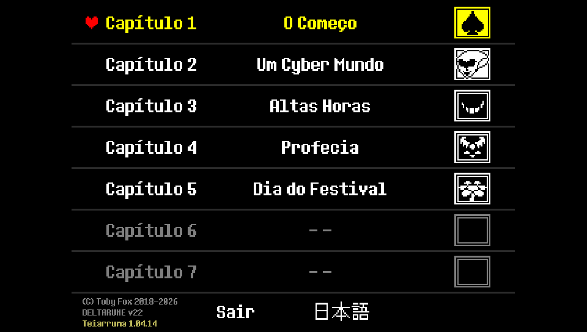
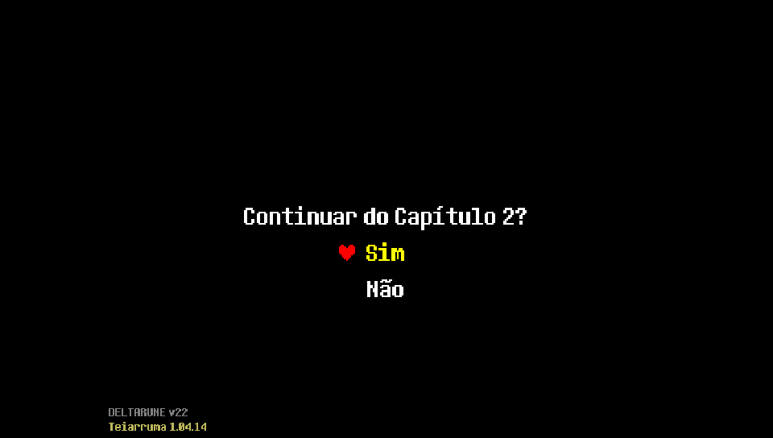
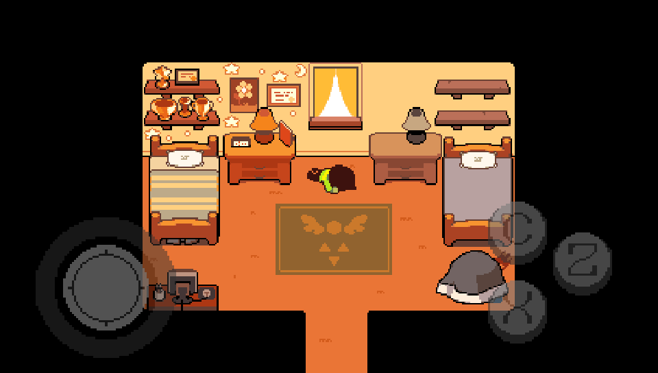
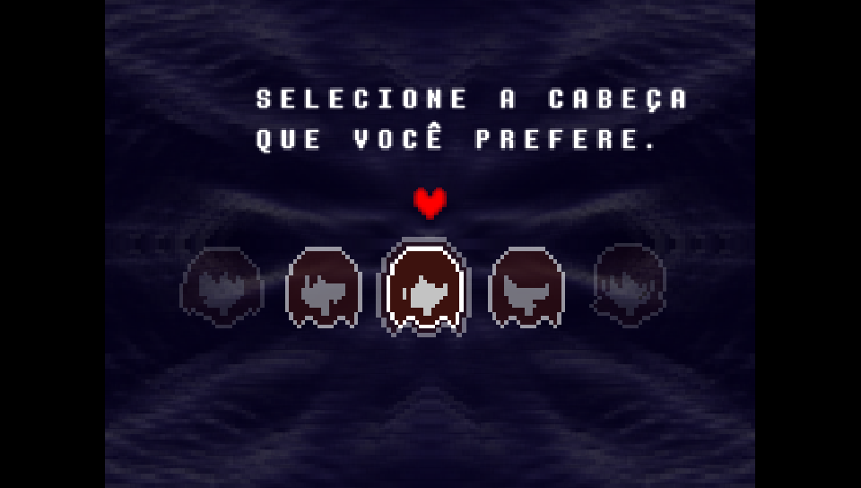
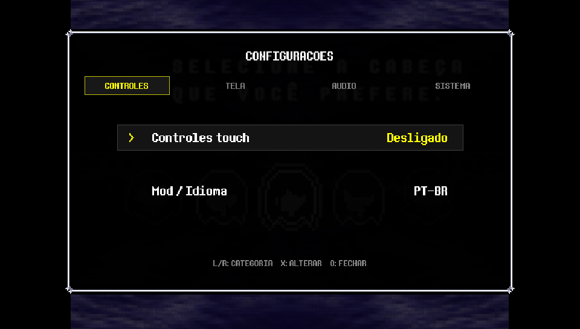
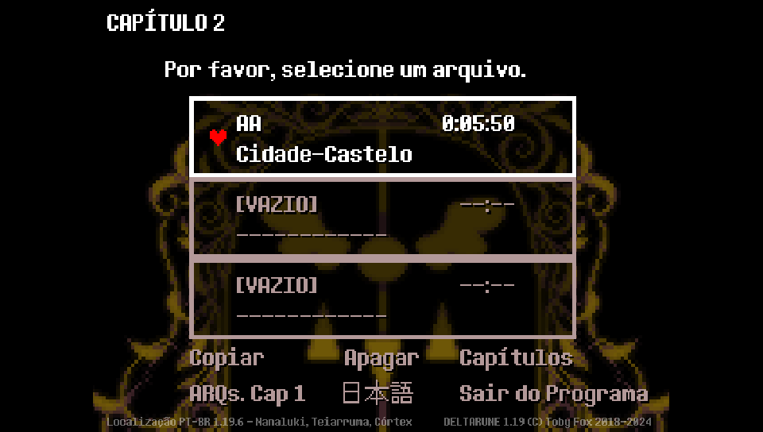
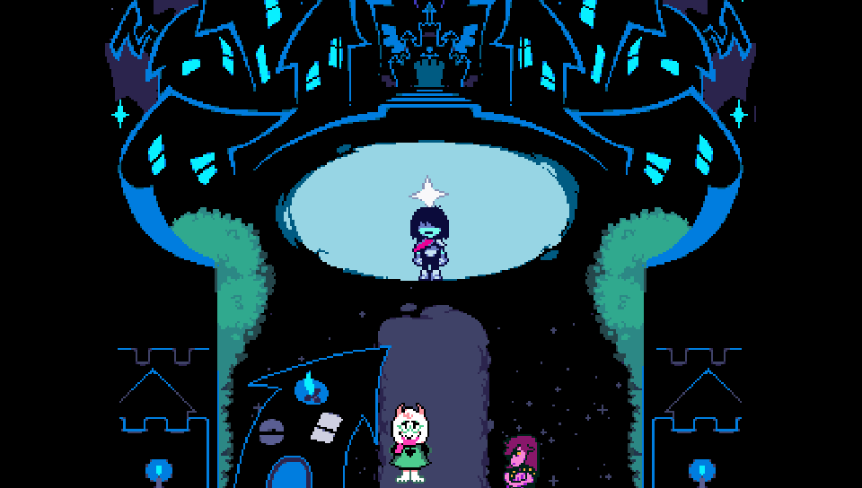

<p align="center">
  <a href="#">
    
  </a>
</p>
<p align="center">
  
</p>

An _unofficial_ port of **DELTARUNE Chapters 1–5** for the PlayStation Vita.

Starting with v0.36, the project directly executes GameMaker data from the Windows/Steam version using a tailored implementation of [Butterscotch](https://github.com/ButterscotchRunner/Butterscotch), with rendering powered by [VitaGL](https://github.com/Rinnegatamante/vitaGL). The Android version is no longer the primary asset source.

> This repository and its releases do not include any commercial assets or files from DELTARUNE.
> Please purchase and obtain the official game at [deltarune.com](https://deltarune.com/).

## Project Status

<p align="center">
  
  &nbsp;
  
  &nbsp;
  
</p>

| Chapter | Details |
| :--- | :--- |
| **1** | Thoroughly reviewed room by room. The run fully verified. Maybe some optimizations remain to be checked. |
| **2** | Received comprehensive fixes (audio, battles, transitions, textures, menus, performance). Some rooms are under observation. |
| **3 and 4**| Fully bootable and playable, subject to testing, optimizations, and perhaps fixes at certain points. |
| **5** | The primary optimization challenge. The city area is highly resource-intensive and may still result in low FPS or crashes. |

<div align="center">
  
  <br><br>
  <a href="https://www.buymeacoffee.com/5rsrt7j4z8f" target="_blank">
    
  </a>
</div>


## Installation Guide

To install the game correctly, follow these steps:

- Install [kubridge](https://github.com/TheOfficialFloW/kubridge/releases/) and [FdFix](https://github.com/TheOfficialFloW/FdFix/releases/) by copying `kubridge.skprx` and `fd_fix.skprx` to your taiHEN plugins folder (usually `ux0:tai`) and adding these entries to `config.txt` under `*KERNEL`:

  ```text
  *KERNEL
  ux0:tai/kubridge.skprx
  ux0:tai/fd_fix.skprx
  ```

  **Note:** Do not install `fd_fix.skprx` if you are using the rePatch plugin.

- **Optional:** Install [PSVshell](https://github.com/Electry/PSVshell/releases) to overclock your device.
- Install `libshacccg.suprx`, if it is not already installed, by following [this guide](https://samilops2.gitbook.io/vita-troubleshooting-guide/shader-compiler/extract-libshacccg.suprx).
- Purchase the official game legally at [deltarune.com](https://deltarune.com/).

### HOW TO APPLY THE PATCH:

To run the game, make sure you have the required data files from an official game installation. The supported Steam version is **v0.0.247 Patch**.  
*PS: The language selection in the patcher only changes the program's interface, not the in-game language.*

1. Purchase and/or install [DELTARUNE for PC](https://deltarune.com/) via Steam.
2. Ensure the installation is on version **v0.0.247 Patch** and contains no modified files.
3. Download the .VPK (`Deltarune-vX.XX.vpk`) and the .ZIP file (`DeltaruneVita-Patcher-vX.XX.zip`) from the [Releases](https://github.com/WolffsRoom/DeltaruneVita/releases/latest) page.
4. Extract the ZIP file to get the patcher.
5. Copy the `DELTARUNE` folder (typically located at `C:\Program Files (x86)\Steam\steamapps\common\`) into the patcher directory at `SteamFiles/DELTARUNE`.
6. Run `DeltaruneVitaPatcher.exe`, select your preferred interface language, and start the process.
7. Copy the generated `deltarune` folder inside `VitaFiles` to `ux0:data/` on your PS Vita. USB transfer or an SD card reader is highly recommended since the file size is quite large (~1.1 GB).
8. Finally, install `Deltarune-vX.XX.vpk` using VitaShell.

#### Observations: 

Ensure that the data files were correctly placed and are located in the following path: `ux0:data/deltarune/deltarunevita/...`, and verify that everything matches the layout shown in [Folder Structure](https://github.com/WolffsRoom/DeltaruneVita#folder-structure).

```text
ux0:data/deltarune/deltarunevita/butterscotch-probe.log
```

> [!IMPORTANT]
> When updating to latest [Realease](https://github.com/WolffsRoom/DeltaruneVita/releases/latest), verifique se é necessário generate and transfer the data again using the newest patcher. Sometimes, Updating only the VPK does not provide the complete cache and data improvements.

## Control Layout

The control layout is based on and adapted from the PS4 version, with additional features tailored for the DeltaruneVita project add-ons (e.g., touch control support and L/R bumper navigation within settings menus).

<table>
  <thead>
    <tr><th>Control</th><th>Action</th><th>Control</th><th>Action</th></tr>
  </thead>
  <tbody>
    <tr>
      <td>   / Left Analog Stick</td>
      <td>Movement</td>
      <td></td>
      <td>Confirm / Interact</td>
    </tr>
    <tr>
      <td> </td>
      <td>Cancel / Back</td>
      <td></td>
      <td>In-game Menu</td>
    </tr>
    <tr>
      <td><strong>SELECT</strong></td>
      <td>Open Game Settings</td>
      <td> </td>
      <td>Navigate categories</td>
    </tr>
    <tr>
      <td></td>
      <td>Virtual controls</td>
      <td>Analog Sticks (Adjust Screen)</td>
      <td>Left moves; Right adjusts zoom</td>
    </tr>
  </tbody>
</table>

## Screenshots (on the PS Vita)

<p align="center">
  
 </p>
<p align="center">
  
  
  
</p>
<p align="center">
  
  
  
</p>

## Official Vídeo 

<div align="center">
  <a href="https://www.youtube.com/watch?v=yDzgiGdekas" target="_blank" title="Assistir à demonstração no YouTube">
    
  </a>
  <br>
  <sup><em>Clique na imagem para assistir ao vídeo completo no YouTube</em></sup>
</div>

##  What already works

<table>
  <thead>
    <tr>
      <th width="50%">Core Features</th>
      <th width="50%">System and Graphics</th>
    </tr>
  </thead>
  <tbody>
    <tr>
      <td>• Chapter selector for all five chapters</td>
      <td>• <code>VitaGL</code> renderer adapted to legacy Butterscotch backend</td>
    </tr>
    <tr>
      <td>• Return to <code>Chapter Select</code> via in-game menu</td>
      <td>• On-demand loading and texture caching for larger chapters</td>
    </tr>
    <tr>
      <td>• Direct parsing of Windows/Steam files</td>
      <td>• Configurable screen position and zoom aspect</td>
    </tr>
    <tr>
      <td>• Vita physical controls and optional touch controls</td>
      <td>• Dynamic console borders based on active chapter and area</td>
    </tr>
    <tr>
      <td>• <code>Game Settings</code> menu in English and Portuguese</td>
      <td>• Save states, per-chapter mods, and PT-BR localization support</td>
    </tr>
    <tr>
      <td>• Independent volume sliders for music and SFX</td>
      <td>• Persistent logging system for error diagnostics</td>
    </tr>
    <tr>
      <td>• Animated chapter loading screen and prepared texture cache</td>
      <td>• Original, Medium, and Low graphics profiles</td>
    </tr>
  </tbody>
</table>

### Project Scope Update

> [!NOTE]
> This project has undergone a change in direction. The scope has been streamlined to focus exclusively on porting directly from **Steam (Windows) to PS Vita**, removing the previous intermediate Android dependency. This ensures better performance, direct file parsing, and a more stable native experience on the console.

The project began with a study of Android ports and resource loading via YoYo Loader/SoLoader, using ChatGPT 5.6 Sol to make the project feasible. This phase was essential for understanding the chapter structure, external files, runner initialization, and touch controls.

Following the initial tests with Butterscotch and VitaGL, the port shifted to loading official data directly from the Windows version. This eliminates the dependency on an APK file and avoids carrying over Android-specific runner limitations.

The current workflow is:

```text
Official PC/Steam Files
           ↓
Per-chapter Data Preparation
           ↓
Butterscotch adapted to Vita
           ↓
VitaGL + OpenAL + Vita Controls
```

### Build Instructions (For Devs)

Place the data file from a legitimate installation in `SteamFiles/DELTARUNE` and run:

```powershell
powershell -ExecutionPolicy Bypass -File .\scripts\prepare-windows-data.ps1
```

The prepared data will be created in:

```text
data/prepared/deltarune/deltarunevita/
```

To build the VPK using Docker and VitaSDK:

```powershell
powershell -ExecutionPolicy Bypass -File .\scripts\build-butterscotch-probe.ps1
```

## Mods

Mod support was implemented specifically to load the community PT-BR translation from [Teiarruma/deltarune-ptbr](https://github.com/teiarruma/deltarune-ptbr). The translation files are not distributed within this repository or its releases.

After obtaining the translation from the original project, place it inside `mods/PTBR` and run:

```powershell
powershell -ExecutionPolicy Bypass -File .\scripts\prepare-vita-mods.ps1
```
> [!NOTE]
> Support for other languages will be implemented in upcoming releases. Since translations primarily involve the main data file (`.win`), the patcher itself will be updated so users can select their preferred language during the data generation process (defaulting to English or the user's choice).

## Recent Changelog

This section briefly documents past versions, covering the initial Android research phase, graphics probing, and early runner evolution.
<details>
  <summary><i>View changelog</i></summary>

<table>
  <thead>
    <tr>
      <th width="20%">Version</th>
      <th width="80%">Key Changes</th>
    </tr>
  </thead>
  <tbody
    <tr>
      <td><code>v0.08</code></td>
      <td>Initial proof-of-concept VPK integrating Butterscotch and VitaGL.</td>
    </tr>
    <tr>
      <td><code>v0.08 - v0.22</code></td>
      <td>Feasibility verifications, asset testing, texture rendering, and audio checks.</td>
    </tr>
    <tr>
      <td><code>v0.23</code></td>
      <td>Chapters 1 and 2 playable for the first time.</td>
    </tr>
    <tr>
      <td><code>v0.24 - v0.34</code></td>
      <td>Various tweaks, bug fixes, and feature implementations based on the Android runner.</td>
    </tr>
    <tr>
      <td><code>v0.35</code></td>
      <td>Final update utilizing assets derived from the Android port.</td>
    </tr>
    <tr>
      <td><code>v0.36</code></td>
      <td>Began migration from Android data files to native Windows/Steam files.</td>
    </tr>
    <tr>
      <td><code>v0.37</code></td>
      <td>Adjustments to Windows runner loading pipelines, custom fonts, and external audio.</td>
    </tr>
    <tr>
      <td><code>v0.38</code></td>
      <td>Reverted to a stable VitaGL library build; fixed first-frame rendering diagnostics.</td>
    </tr>
    <tr>
      <td><code>v0.39</code></td>
      <td>Fixed a critical crash caused by the touch controls overlay.</td>
    </tr>
    <tr>
      <td><code>v0.40</code></td>
      <td>External music support, redesigned Game Settings, Chapter Select menu, texture caching, and console borders.</td>
    </tr>
    <tr>
      <td><code>v0.41</code></td>
      <td>Audio streaming implementation, dynamic context-aware borders, and performance drop logging.</td>
    </tr>
    <tr>
      <td><code>v0.42</code></td>
      <td>Fixed audio file pathing and reduced texture thrashing/reloading in Chapter 2.</td>
    </tr>
    <tr>
      <td><code>v0.43</code></td>
      <td>Direct access to the Vita music library; fixed a track synchronization bug on the Chapter 5 logo.</td>
    </tr>
    <tr>
      <td><code>v0.44</code></td>
      <td>Optimized texture atlas footprint and increased the audio streaming buffer size.</td>
    </tr>
    <tr>
      <td><code>v0.45</code></td>
      <td>Overhauled and streamlined the Game Settings user interface.</td>
    </tr>
    <tr>
      <td><code>v0.46</code></td>
      <td>Fixed a regression bug that prevented chapters from booting properly.</td>
    </tr>
    <tr>
      <td><code>v0.47</code></td>
      <td>Added a confirmation prompt to Chapter Select, restored the settings icon, and expanded the texture cache.</td>
    </tr>
    <tr>
      <td><code>v0.48</code></td>
      <td>Implemented off-camera tile culling to boost performance in the Chapter 5 city area.</td>
    </tr>
    <tr>
      <td><code>v0.49</code></td>
      <td>Fixed font rendering in Chapter 5, added screen fades when loading save states, and released the first public patcher tool.</td>
    </tr>
    <tr>
      <td><code>v0.50</code></td>
      <td>Improved audio and texture caching, room transitions, dynamic borders, touch defaults, and Chapter 2/5 stability.</td>
    </tr>
    <tr>
      <td><code>v0.51</code></td>
      <td>Added patcher-generated texture preparation, chapter cache loading, and further runtime performance diagnostics.</td>
    </tr>
    <tr>
      <td><code>v0.52</code></td>
      <td>Added animated chapter loading, Debug Dev captures, RAM texture cache, font-safe texture optimization, and selectable Original/Medium/Low graphics profiles.</td>
    </tr>
  </tbody>
</table>
</details>

## Folder Structure

- Game data:
```text
ux0:data/deltarune/
├── config.ini
└── deltarunevita/
    ├── borders/
    ├── chapter0/
    ├── chapter1/
    ├── chapter2/
    ├── chapter3/
    ├── chapter4/
    ├── chapter5/
    ├── devlogs/
    ├── mods/
    ├── music/
    └── texture-cache/
```
- Save date:
```text
ux0:data/DeltaruneSaves/
├── true_config.ini
├── dr.ini/
└── DLTR00000/
    ├── sce_pfs/
    ├── sce_sys/
    ├── config_0.ini/
    ├── dr.ini/
    ├── filech1_0/
    ├── filech1_9/
    └── true_config.ini
```

The main file log is saved in:
```text
ux0:data/deltarune/deltarunevita/butterscotch-probe.log
```

> [!TIP]
> Logging features will be removed once the final version is released. Until then, if you encounter any bugs or issues, please attach the `.log` file when submitting a report on the [Issues](https://github.com/WolffsRoom/DeltaruneVita/issues).

## Credits

- DELTARUNE by Toby Fox and team. [Official website and purchase](https://deltarune.com/).
- [Deltarune Chapters 1–5 Android Port](https://gamejolt.com/games/deltarunech1-5androidport/1080568), an important reference during initial research.
- [Deltarune Android Port by AngelaPuzzle and contributors](https://angelapuzzle.wixsite.com/dt-port), fundamental for understanding chapter adaptation, external assets, touch controls, and borders. The touch control graphics used as a baseline in this port originated from this work.
- [Butterscotch](https://github.com/ButterscotchRunner/Butterscotch), an open-source GameMaker runner.
- [VitaGL](https://github.com/Rinnegatamante/vitaGL) by Rinnegatamante.
- [VitaSDK](https://vitasdk.org/) and the PlayStation Vita homebrew community.
- [Vita Development Wiki / PSDevWiki](https://www.psdevwiki.com/vita/) for technical documentation.
- [DELTARUNE PT-BR Translation](https://github.com/teiarruma/deltarune-ptbr) for the PT-BR localization by the TEIARRUMA team and contributors.

## AI Notice

GPT-5.6 Sol (Codex IDE) was integrated into the workflow to support development (specifically for the loader's programming logic), diagnostics, project organization, and documentation.

## Licença e dados do jogo

Portions derived from `Butterscotch` remain under the Mozilla Public License 2.0. See [LICENSE](LICENSE).

<p align="center">
  
</p>

<p align="center">
  <sub>
    DELTARUNE © Toby Fox 2018-2026. All rights reserved.<br>
    Steam and the Steam logo are trademarks and/or registered trademarks of Valve Corporation in the U.S. and/or other countries.<br>
    "PlayStation" and the "PS" Family logo are registered trademarks, and "PS4", "PSVita" and "PS5" are trademarks of Sony Interactive Entertainment LLC.<br>
    DELTARUNE, its characters, music, and assets belong to their respective owners. This project does not distribute the commercial files required to play the game.
  </sub>
</p>
