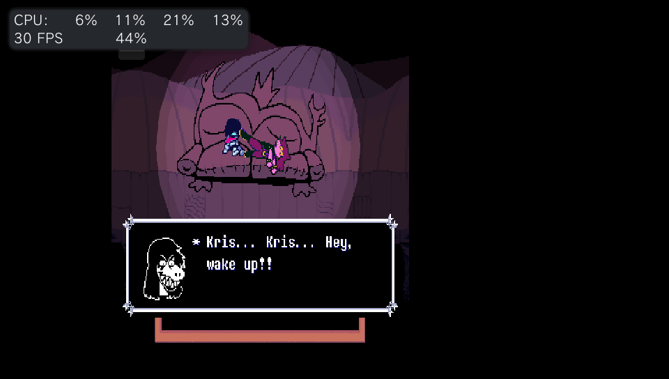

# Deltarune Vita

Port jogável de **DELTARUNE Chapters 1–5** para PlayStation Vita.

O projeto executa os dados GameMaker da versão Android através de uma adaptação do [Butterscotch](https://github.com/ButterscotchRunner/Butterscotch), com renderização pelo [VitaGL](https://github.com/Rinnegatamante/vitaGL). A proposta é ter um port nativo para o Vita, com seletor de capítulos, controles físicos e touch, áudio, saves e ajustes próprios para a tela e a memória do console.

> Este repositório não contém os dados comerciais de DELTARUNE. É necessário obter os arquivos do jogo legalmente.



## Estado atual

A versão atual é a **v0.31**. Os capítulos 1 a 5 inicializam e são jogáveis no hardware real.

- seletor e troca de capítulos;
- renderização VitaGL adaptada ao renderer legado do Butterscotch;
- áudio OpenAL;
- controles físicos do Vita;
- controles touch com os gráficos originais do jogo;
- menu Game Settings em inglês e português;
- suporte a mods por capítulo, incluindo preparação de PT-BR;
- volume, touch e modo de tela configuráveis;
- posição e zoom da tela ajustáveis pelo usuário;
- perfil ampliado de memória e carregamento sob demanda;
- log persistente para diagnóstico.

Ainda podem existir diferenças gráficas, de desempenho ou de compatibilidade em cenas específicas. Relatos acompanhados do log ajudam a localizar esses casos.

## Instalação

1. Instale o VPK da [release mais recente](https://github.com/WolffsRoom/DeltaruneVita/releases/latest).
2. Extraia legalmente os dados da versão Android para `data/extracted-apk/assets`.
3. Execute:

```powershell
powershell -ExecutionPolicy Bypass -File .\scripts\prepare-butterscotch-data.ps1
```

4. Copie o conteúdo de `data/prepared/deltarune/butterscotch` para:

```text
ux0:data/deltarune/butterscotch/
```

A estrutura deve conter `chapter0` até `chapter5`, cada um com seu `game.droid` e os demais assets do capítulo. Não copie apenas o `game.droid`, pois música, sons e arquivos auxiliares também são necessários.

## Controles

- Direcional ou analógico esquerdo: movimento
- X: confirmar
- Círculo ou Quadrado: cancelar
- Triângulo: menu do jogo
- SELECT: Game Settings
- L/R: Page Down/Page Up
- Touch frontal: controles virtuais, quando ativados

Em **Adjust Screen**, o analógico esquerdo move a imagem e o analógico direito ajusta o zoom. X salva e Círculo restaura o padrão.

## Mods

Mods de PC precisam ser preparados para a estrutura usada no Vita. Coloque os arquivos-fonte em `mods/PTBR` e execute:

```powershell
powershell -ExecutionPolicy Bypass -File .\scripts\prepare-vita-mods.ps1
```

Copie a pasta `mods` gerada para `ux0:data/deltarune/butterscotch/`. A seleção pode ser feita em Game Settings; quando necessário, o capítulo é reiniciado para aplicar os dados.

## Compilação

Com Docker instalado:

```powershell
powershell -ExecutionPolicy Bypass -File .\scripts\build-butterscotch-probe.ps1
```

O resultado será criado em `artifacts/current/Deltarune.vpk`.

Configuração principal:

- Title ID: `DLTVITA01`
- Nome: `Deltarune`
- memória ampliada: `ATTRIBUTE2=12`
- stack principal: 4 MiB
- pool VitaGL: 64 MiB

## Logs

```text
ux0:data/deltarune/butterscotch/butterscotch-probe.log
```

Em caso de crash, anexe também o arquivo `psp2core` gerado pelo Vita.

## Créditos

- DELTARUNE por Toby Fox e sua equipe.
- [Port original para Android](https://gamejolt.com/games/deltarunech1-5androidport/1080568), usado como referência para os dados e a divisão dos capítulos.
- [Butterscotch](https://github.com/ButterscotchRunner/Butterscotch), runner GameMaker de código aberto.
- [VitaGL](https://github.com/Rinnegatamante/vitaGL) por Rinnegatamante.
- [VitaSDK](https://vitasdk.org/) e comunidade homebrew do PlayStation Vita.
- Agradecimento ao [Vita Development Wiki / PSDevWiki](https://www.psdevwiki.com/vita/) pela documentação técnica reunida pela comunidade.

## AI Notice

GPT-5.6 Sol foi usado como apoio no desenvolvimento, diagnóstico, organização do projeto e documentação. As decisões, testes em hardware e direção do port foram conduzidos por Wolff.

## Licença e dados do jogo

As partes derivadas do Butterscotch permanecem sob a Mozilla Public License 2.0. Consulte [LICENSE](LICENSE) e os avisos presentes no código-fonte.

DELTARUNE, seus personagens, músicas e assets pertencem aos respectivos detentores. O repositório e as releases não distribuem os dados necessários para jogar.

O histórico técnico completo está em [docs/PROGRESS.md](docs/PROGRESS.md) e as mudanças por versão em [CHANGELOG.md](CHANGELOG.md).
