<p align="center">
  <a href="#">
    
  </a>
</p>
<p align="center">
  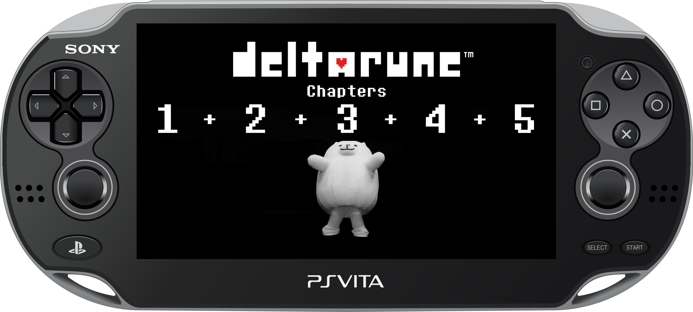
</p>

An _unofficial_ port of **DELTARUNE Chapters 1–5** for the PlayStation Vita.

The project runs the original Deltarune data, created with GameMaker Studio for Windows/Steam, using a customized version of [Butterscotch](https://github.com/ButterscotchRunner/Butterscotch), with rendering provided by [VitaGL](https://github.com/rinnegatamante/vitagl). DeltaruneVita includes Vita controls, optional touch input, configurable graphics and audio, console borders, mod support, diagnostic tools, and dedicated patchers that generate the required data from a legally obtained copy of the game.
 
> This repository and its releases do not include any commercial assets or files from DELTARUNE.
> Please purchase and obtain the official game at [deltarune.com](https://deltarune.com/).

## Project Status

<div align="center">
  <a href="https://github.com/WolffsRoom/DeltaruneVita/releases"></a>
  <a href="https://github.com/WolffsRoom/DeltaruneVita/releases/latest"></a>
  <br>
  
  
  
</div>

<br>


| Chapter | Details |
| :--- | :--- |
| **1** | Playable and reviewed extensively. |
| **2** | Playable, including the three light puzzles. Several performance and rendering issues were corrected. |
| **3** | It isn't very playable, even with the fixes to the navigation system and performance in large areas, there are still many glitches due to a lack of texture optimization. |
| **4** | It works, with fixes related to runtime and interface compatibility. No comprehensive tests have yet been reported or conducted in Chapter 4. |
| **5** | It works, but isn't very playable. This chapter now considerably faster in urban areas, but that remains the most demanding part. Further optimization is planned for the World of Darkness.|

<div align="center">

### Support this and other projects
If you enjoy my work, consider supporting the development!

[](https://www.buymeacoffee.com/5rsrt7j4z8f)

</div>

<br>

## Installation Guide

To install the game correctly, follow these steps:

- Install [kubridge](https://github.com/TheOfficialFloW/kubridge/releases/) and [FdFix](https://github.com/TheOfficialFloW/FdFix/releases/) by copying `kubridge.skprx` and `fd_fix.skprx` to your taiHEN plugins folder (usually `ux0:tai`) and adding these entries to `config.txt` under `*KERNEL`:

  ```text
  *KERNEL
  ux0:tai/kubridge.skprx
  ux0:tai/fd_fix.skprx
  ```

  **Note:** Do not install `fd_fix.skprx` if you are using the rePatch plugin.

- **Optional:** Install [PSVshell](https://github.com/Electry/PSVshell/releases) to overclock your device.
- Install `libshacccg.suprx`, if it is not already installed, by following [this guide](https://samilops2.gitbook.io/vita-troubleshooting-guide/shader-compiler/extract-libshacccg.suprx).

### HOW TO APPLY THE PATCH:

The patchers require an official, unmodified DELTARUNE installation.

> [!IMPORTANT]
> Check the latest release notes to verify the Steam version's compatibility

1. Purchase and install [DELTARUNE for PC](https://store.steampowered.com/app/1671210/) through Steam.
2. Confirm that the installation is updated to latests version and contains no modified files.
3. Download `Deltarune-vX.XX.vpk` and one of the patchers from the [latest release](https://github.com/WolffsRoom/DeltaruneVita/releases/latest).
4. Generate the Vita data using either DeltaruneVita Patcher (terminal-like) or the [Seam's Patcher](https://wolffsroom.github.io/DeltaruneVita/) (Seam's Patcher is available in .exe format in case you encounter issues with the GitHub pages).
5. Copy the generated `deltarune` folder to `ux0:data/` on the PS Vita. USB transfer or an SD card reader is recommended.
6. Install `Deltarune-vX.XX.vpk` using VitaShell.

Now, the language selected in the Patcher will check for the availability of a language mod to modify the game. A translation can be added manually to `deltarunevita/mods`

### DeltaruneVita Patcher (terminal-like)

1. Extract the 32-bit or 64-bit `Deltarune Vita Patcher` ZIP.
2. Copy the complete Steam `DELTARUNE` folder into `SteamFiles/DELTARUNE`.
> 

3. Run `DeltaruneVitaPatcher.exe` and follow the displayed instructions.
4. The finished data will be created under `VitaFiles/deltarune`.

**Visual guide below:**

 <p align="center">
  
  
  
</p>

### Seam's Patcher (DeltaruneVita Web Patcher)

Designed to mimic Seam's shop from Deltarune, [Seam's Patcher](https://wolffsroom.github.io/DeltaruneVita/) offers a more immersive patching experience. The web-first approach via GitHub Pages ensures the patcher remains accessible on any platform and receives instant updates.

Seam's Patcher (.exe) provides the Patcher in the Web experience as a Windows application. It runs opens in a clean web application window without browser tabs or an address bar.

1. Extract the correct 32-bit or 64-bit `Seam's Patcher` ZIP. 
2. Run `SeamsPatcher.exe`.
> 

3. Select the official DELTARUNE Steam folder when requested.
4. Choose optional language/mod settings and generate the Vita package.
5. Extract the generated package and transfer its `deltarune` folder to `ux0:data/`.

**Visual guide below:**

 <p align="center">
  
  
  
</p>

You can also access the Seam store directly through your preferred browser using the **[Seam Patcher](https://wolffsroom.github.io/DeltaruneVita/)**.


#### Observations: 

Ensure that the data files were correctly placed and are located in the following path: `ux0:data/deltarune/deltarunevita/...`, and verify that everything matches the layout shown in [Folder Structure](https://github.com/WolffsRoom/DeltaruneVita#folder-structure).

```text
ux0:data/deltarune/deltarunevita/butterscotch-probe.log
```

> [!IMPORTANT]
> When updating to the [latest release](https://github.com/WolffsRoom/DeltaruneVita/releases/latest), check whether the release requires regenerating and transferring the data with the newest patcher. Installing only the VPK may omit required data or cache improvements.

## Control Layout

The control layout is based on and adapted from the PS4 version, with additional features tailored for the DeltaruneVita project add-ons (e.g., touch control support and L/R bumper navigation within settings menus).

<p align="center">
  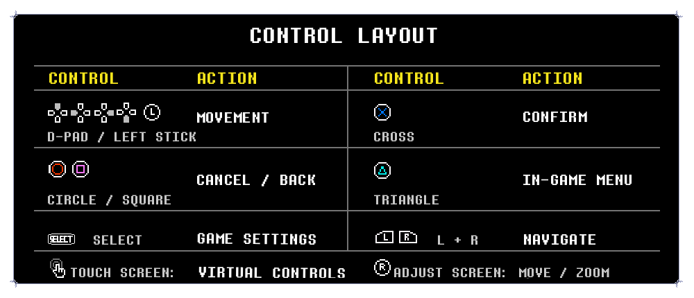
</p>

## Screenshots (on the PS Vita)

<p align="center">
  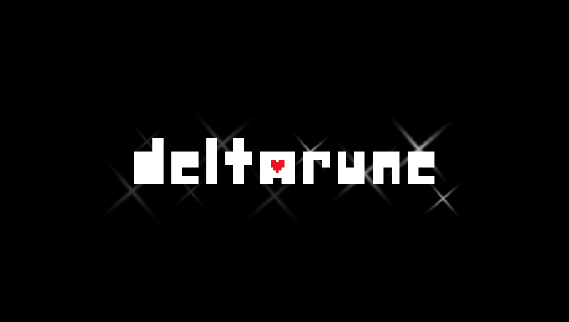
  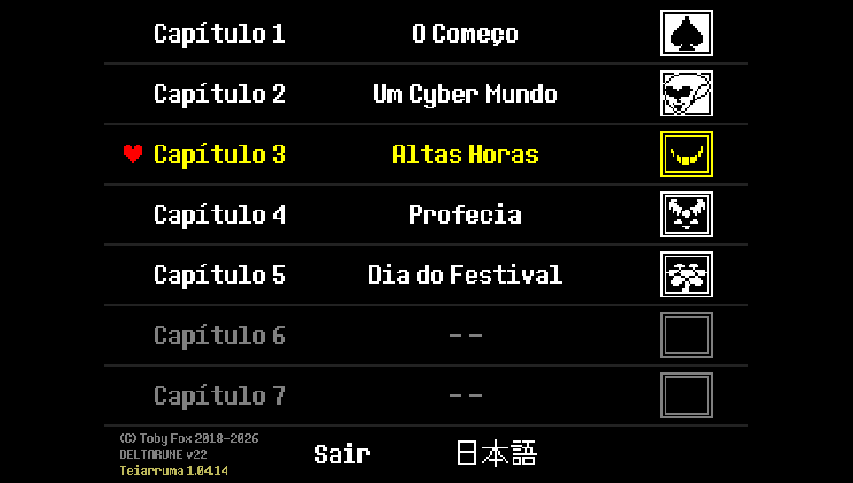
</p>
<p align="center">
  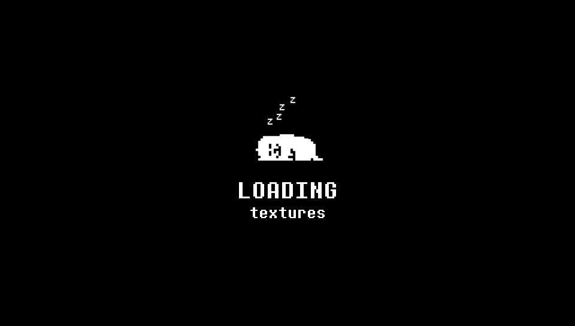
  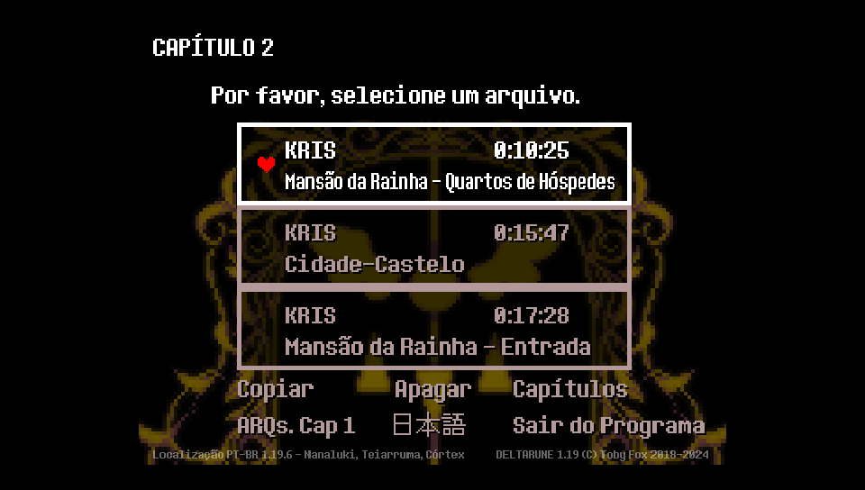
  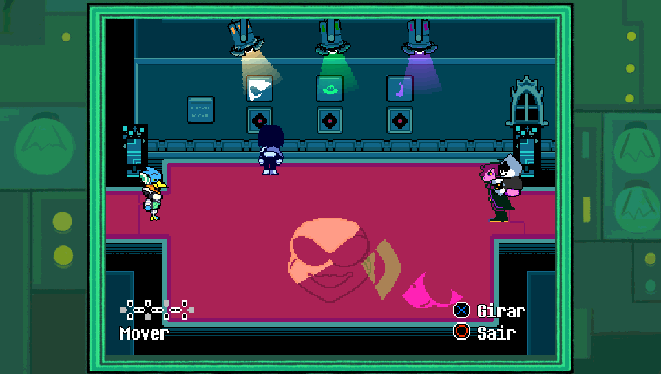
</p>
<p align="center">
  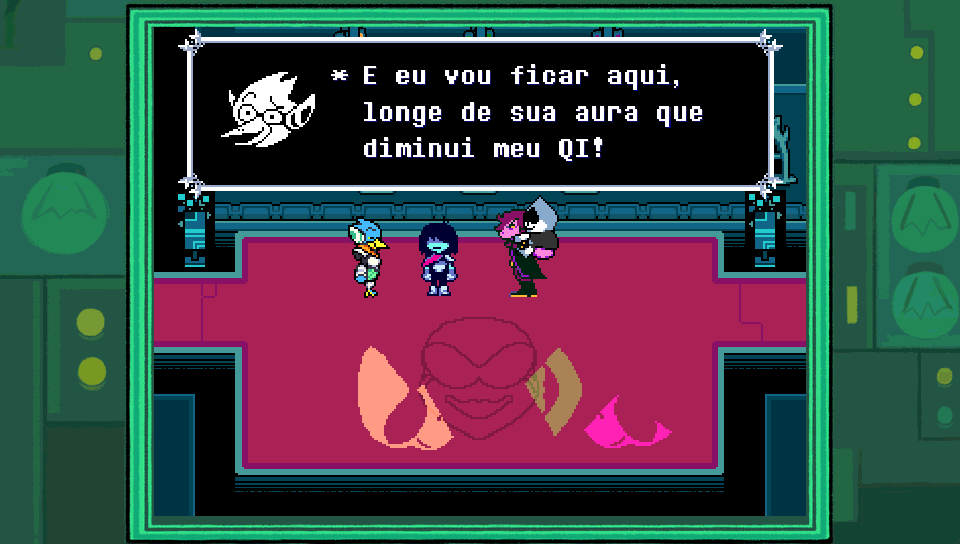
  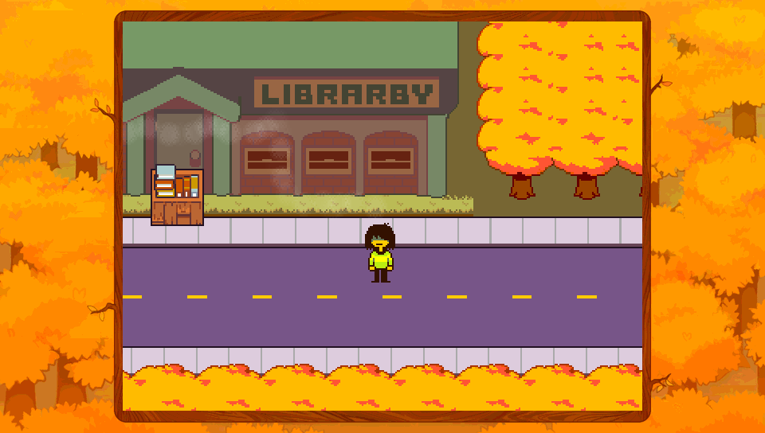
  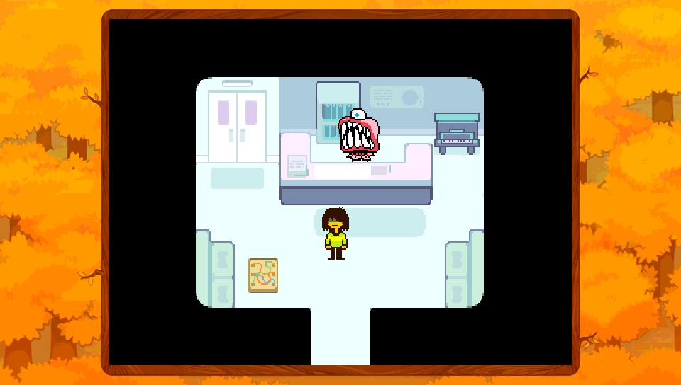
</p>

### Game Settings

<p align="center">
  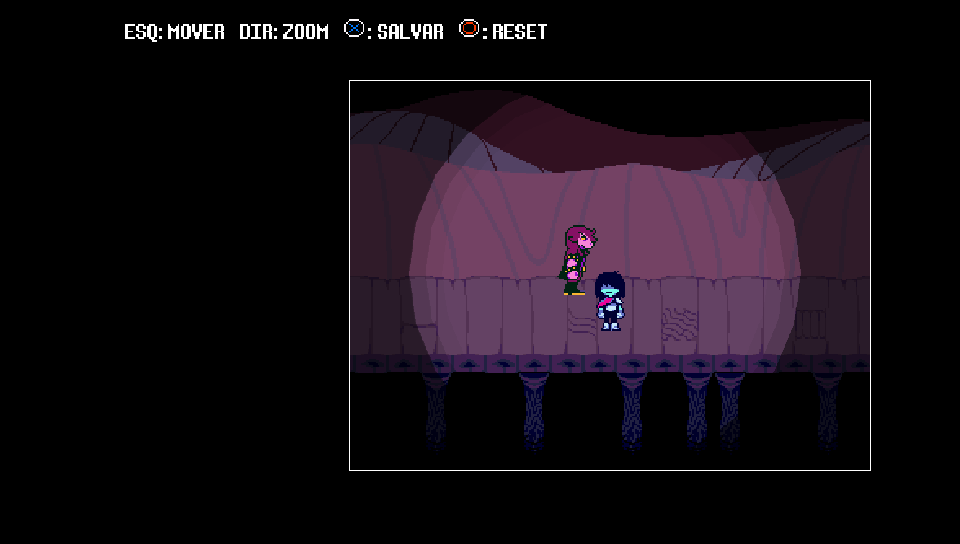
  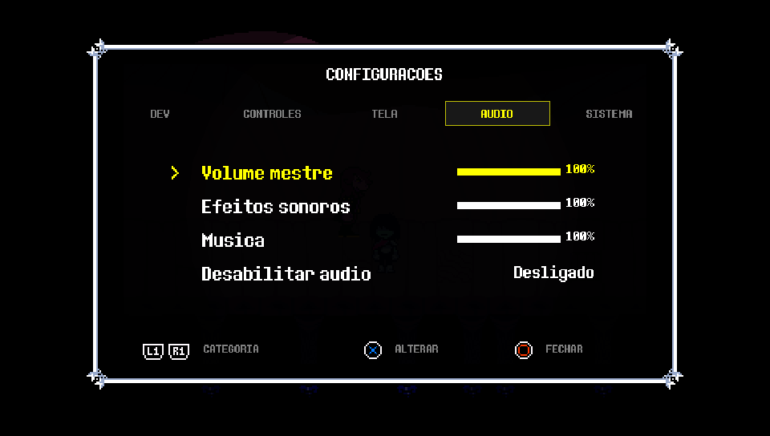
  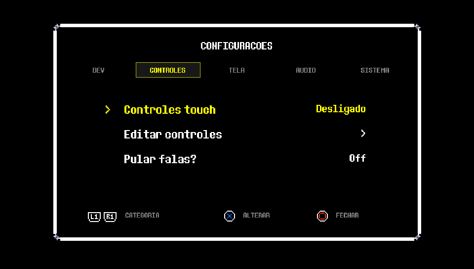
</p>
<p align="center">
  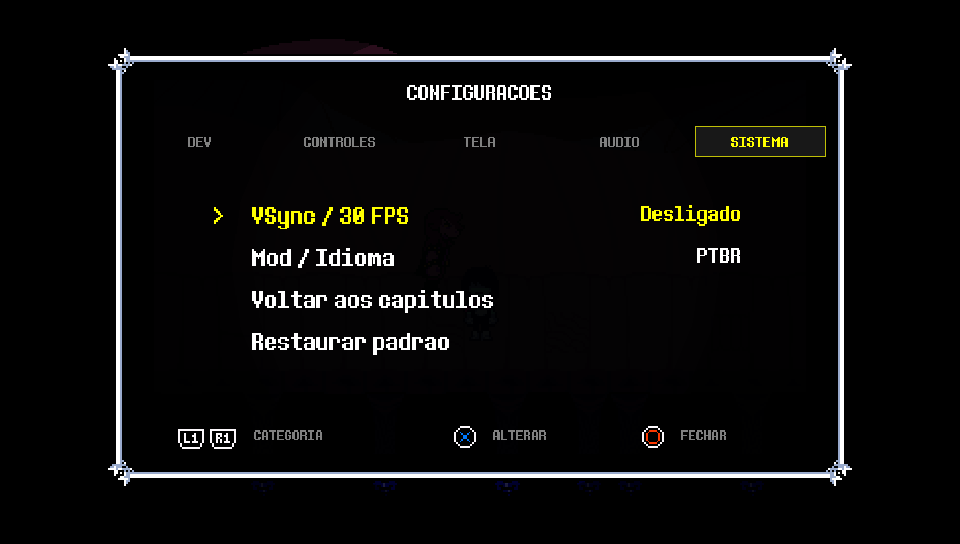
  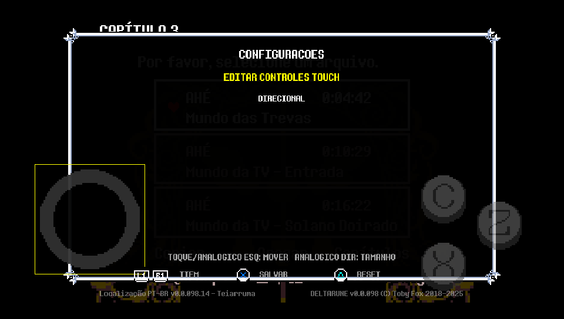
  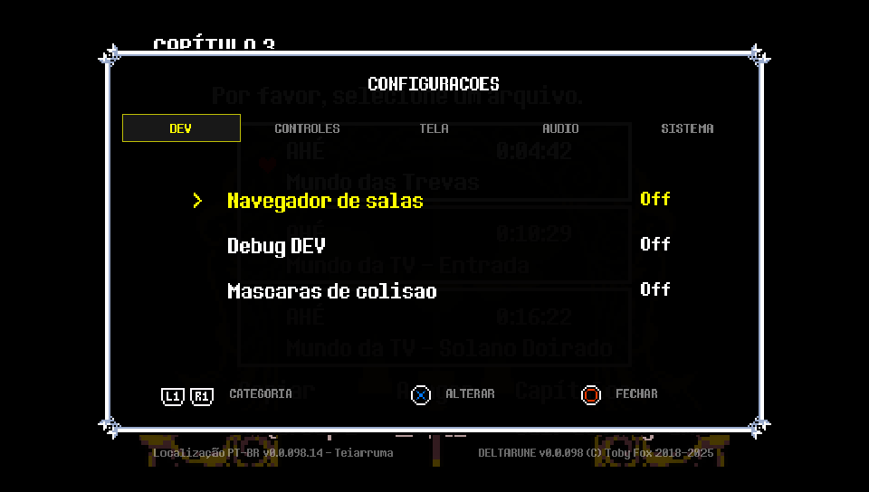
</p>

<div align="center">

  ### DELTARUNE for PS Vita (v0.64 Showcase)

  <a href="https://youtu.be/qxZaAjv8iiE">
    
  </a>
  <a href="https://youtu.be/qxZaAjv8iiE">
    
  </a>

</div>

##  What already works

<table>
  <thead>
    <tr>
      <th width="50%">Core Features</th>
      <th width="50%">System and Graphics</th>
    </tr>
  </thead>
  <tbody>
    <tr>
      <td>• Chapter selector for all five chapters</td>
      <td>• <code>VitaGL</code> renderer adapted to legacy Butterscotch backend</td>
    </tr>
    <tr>
      <td>• Return to <code>Chapter Select</code> via in-game menu</td>
      <td>• On-demand loading and texture caching for larger chapters</td>
    </tr>
    <tr>
      <td>• Direct parsing of Windows/Steam files</td>
      <td>• Configurable screen position and zoom aspect</td>
    </tr>
    <tr>
      <td>• Vita physical controls and optional touch controls</td>
      <td>• Dynamic console borders based on active chapter and area</td>
    </tr>
    <tr>
      <td>• <code>Game Settings</code> menu in English and Portuguese</td>
      <td>• Save states, per-chapter mods, and PT-BR localization support</td>
    </tr>
    <tr>
      <td>• Independent volume sliders for music and SFX</td>
      <td>• Persistent logging system for error diagnostics</td>
    </tr>
    <tr>
      <td>• Animated chapter loading screen and prepared texture cache</td>
      <td>• Original, Medium, and Low graphics profiles</td>
    </tr>
  </tbody>
</table>

### Project Scope Update

> [!NOTE]
> This project has undergone a change in direction. The scope has been streamlined to focus exclusively on porting directly from **Steam (Windows) to PS Vita**, removing the previous intermediate Android dependency. This ensures better performance, direct file parsing, and a more stable native experience on the console.

The project began with a study of Android ports and resource loading via YoYo Loader/SoLoader, using ChatGPT 5.6 Sol to make the project feasible. This phase was essential for understanding the chapter structure, external files, runner initialization, and touch controls.

Following the initial tests with Butterscotch and VitaGL, the port shifted to loading official data directly from the Windows version. This eliminates the dependency on an APK file and avoids carrying over Android-specific runner limitations.

The current workflow is:

```text
Official PC/Steam Files
           ↓
Per-chapter Data Preparation
           ↓
Butterscotch adapted to Vita
           ↓
VitaGL + OpenAL + Vita Controls
```

## Build Instructions (For Developers)

### Requirements

- Windows 10 or 11;
- PowerShell 5.1 or newer;
- Docker Desktop with Linux containers enabled;
- Git with submodule support;
- An official and unmodified DELTARUNE Steam installation.

The standard build uses VitaSDK through Docker, so a separate VitaSDK installation on Windows is not required.

### Preparing the game data

Place the official Steam files inside:

```text
SteamFiles/DELTARUNE/
```

Run:

```powershell
powershell -ExecutionPolicy Bypass -File .\scripts\prepare-windows-data.ps1
```

The prepared data will be generated in:

```text
data/prepared/deltarune/
```

Each chapter keeps its original Windows `data.win`. Starting with v0.64, files are no longer renamed to `game.droid`.

### Building the VPK

With Docker Desktop running, execute:

```powershell
powershell -ExecutionPolicy Bypass -File .\scripts\build-butterscotch-probe.ps1
```

The generated VPK and related files will be placed under:

```text
artifacts/current/
```

### Building the patchers

The Windows patcher project is located at:

```text
artifacts/Patcher/Build_Patch/
```

Run:

```bat
Build_Patcher.bat
```

The build menu can compile the patchers using the current patch data or regenerate the patch data from `SteamFiles` and `VitaFiles` first.

> [!IMPORTANT]
> Please, don't share the commercial DELTARUNE files. must never be committed or distributed. Only the VPK, patch data and tools used to generate the Vita files may be published.

<br>
<br>

## Butterscotch + VitaGL: How It Works

DELTARUNE Vita does not emulate Windows or execute the original game executable. It loads the GameMaker data from the official Steam version and runs it through a customized native runner.

```text
Official Steam files
        ↓
Per-chapter data.win
        ↓
Customized Butterscotch runner
        ↓
GameMaker rooms, objects, scripts and events
        ↓
VitaGL rendering backend
        ↓
PS Vita display, audio and controls
```

---

### Butterscotch

[Butterscotch](https://github.com/ButterscotchRunner/Butterscotch) reads and executes the GameMaker data stored in each chapter’s `data.win`.

The customized runner includes:

- Additional GameMaker built-in functions required by DELTARUNE;
- Vita physical controls and touch input;
- Audio streaming and caching;
- Surface and buffer compatibility;
- Room, texture and audio preloading;
- Texture-cache management adapted to Vita memory limits;
- Mods and alternative `data.win` support;
- Developer logging, profiling and room diagnostics;
- Chapter-specific fixes for puzzles, events and softlocks.

The chapter selector acts as a launcher. When a chapter is selected, the runner initializes its corresponding GameMaker data.

---

### VitaGL

[VitaGL](https://github.com/Rinnegatamante/vitaGL) translates the runner’s rendering operations to the PS Vita GPU.

It handles:

- Sprites, backgrounds, tiles and primitives;
- GameMaker surfaces and render targets;
- Texture uploads and filtering;
- Blending, transparency and color operations;
- Screen scaling and positioning;
- Console borders;
- GPU memory allocation through CDRAM.

The port currently uses the `legacy-gl` rendering path. 

---

### Vita-specific layeer - Game Settings

A separate Vita frontend provides:

- Game Settings;
- Physical and touch controls;
- Screen position and zoom adjustment;
- Dynamic console borders;
- Music and sound controls;
- Save-directory management;
- Loading and cache screens;
- Development overlays and diagnostic logs.

This separation keeps most GameMaker behavior inside Butterscotch while platform-specific features are handled by the Vita frontend.

---

### Memory and performance

The PS Vita has considerably less memory than a modern PC. Later DELTARUNE chapters contain large texture pages, complex rooms and many simultaneous objects.

The port manages these limitations through:

- Chapter-specific loading;
- On-demand texture uploads;
- Protected font and interface atlases;
- RAM and CDRAM texture caches;
- Texture eviction and reuse;
- Audio preloading and streaming;
- Off-screen rendering optimizations;
- Original, Medium and Low graphics profiles.

These systems make all five chapters bootable and playable, although particularly demanding areas may still require further optimization.

## Mods

Mod support was implemented specifically to load the community PT-BR translation from [Teiarruma/deltarune-ptbr](https://github.com/teiarruma/deltarune-ptbr). The translation files are not distributed within this repository or its releases.

After obtaining the translation from the original project, place it inside `mods/PTBR` and run:

```powershell
powershell -ExecutionPolicy Bypass -File .\scripts\prepare-vita-mods.ps1
```
> [!NOTE]
> Support for other languages will be implemented in upcoming releases. Since translations primarily involve the main data file (`.win`), the patcher itself will be updated so users can select their preferred language during the data generation process (defaulting to English or the user's choice).

## Recent Changelog

This section briefly documents past versions, covering the initial Android research phase, graphics probing, and early runner evolution.
<details>
  <summary><i>View changelog</i></summary>

<table>
  <thead>
    <tr>
      <th width="20%">Version</th>
      <th width="80%">Key Changes</th>
    </tr>
  </thead>
  <tbody
    <tr>
      <td><code>v0.08</code></td>
      <td>Initial proof-of-concept VPK integrating Butterscotch and VitaGL.</td>
    </tr>
    <tr>
      <td><code>v0.08 - v0.22</code></td>
      <td>Feasibility verifications, asset testing, texture rendering, and audio checks.</td>
    </tr>
    <tr>
      <td><code>v0.23</code></td>
      <td>Chapters 1 and 2 playable for the first time.</td>
    </tr>
    <tr>
      <td><code>v0.24 - v0.34</code></td>
      <td>Various tweaks, bug fixes, and feature implementations based on the Android runner.</td>
    </tr>
    <tr>
      <td><code>v0.35</code></td>
      <td>Final update utilizing assets derived from the Android port.</td>
    </tr>
    <tr>
      <td><code>v0.36</code></td>
      <td>Began migration from Android data files to native Windows/Steam files.</td>
    </tr>
    <tr>
      <td><code>v0.37</code></td>
      <td>Adjustments to Windows runner loading pipelines, custom fonts, and external audio.</td>
    </tr>
    <tr>
      <td><code>v0.38</code></td>
      <td>Reverted to a stable VitaGL library build; fixed first-frame rendering diagnostics.</td>
    </tr>
    <tr>
      <td><code>v0.39</code></td>
      <td>Fixed a critical crash caused by the touch controls overlay.</td>
    </tr>
    <tr>
      <td><code>v0.40</code></td>
      <td>External music support, redesigned Game Settings, Chapter Select menu, texture caching, and console borders.</td>
    </tr>
    <tr>
      <td><code>v0.41</code></td>
      <td>Audio streaming implementation, dynamic context-aware borders, and performance drop logging.</td>
    </tr>
    <tr>
      <td><code>v0.42</code></td>
      <td>Fixed audio file pathing and reduced texture thrashing/reloading in Chapter 2.</td>
    </tr>
    <tr>
      <td><code>v0.43</code></td>
      <td>Direct access to the Vita music library; fixed a track synchronization bug on the Chapter 5 logo.</td>
    </tr>
    <tr>
      <td><code>v0.44</code></td>
      <td>Optimized texture atlas footprint and increased the audio streaming buffer size.</td>
    </tr>
    <tr>
      <td><code>v0.45</code></td>
      <td>Overhauled and streamlined the Game Settings user interface.</td>
    </tr>
    <tr>
      <td><code>v0.46</code></td>
      <td>Fixed a regression bug that prevented chapters from booting properly.</td>
    </tr>
    <tr>
      <td><code>v0.47</code></td>
      <td>Added a confirmation prompt to Chapter Select, restored the settings icon, and expanded the texture cache.</td>
    </tr>
    <tr>
      <td><code>v0.48</code></td>
      <td>Implemented off-camera tile culling to boost performance in the Chapter 5 city area.</td>
    </tr>
    <tr>
      <td><code>v0.49</code></td>
      <td>Fixed font rendering in Chapter 5, added screen fades when loading save states, and released the first public patcher tool.</td>
    </tr>
    <tr>
      <td><code>v0.50</code></td>
      <td>Improved audio and texture caching, room transitions, dynamic borders, touch defaults, and Chapter 2/5 stability.</td>
    </tr>
    <tr>
      <td><code>v0.51</code></td>
      <td>Added patcher-generated texture preparation, chapter cache loading, and further runtime performance diagnostics.</td>
    </tr>
    <tr>
      <td><code>v0.52</code></td>
      <td>Added animated chapter loading, Debug Dev captures, RAM texture cache, font-safe texture optimization, and selectable Original/Medium/Low graphics profiles.</td>
    </tr>
    <tr>
      <td><code>v0.53 - v0.57</code></td>
      <td>Expanded profiling, audio and texture caches, touch editing, dynamic borders, room navigation, separate saves, and broad Chapter 1/2 stability work.</td>
    </tr>
    <tr>
      <td><code>v0.58 - v0.63</code></td>
      <td>Added missing GameMaker behavior, puzzle diagnostics, rendering optimizations, surface compatibility fixes, improved settings icons, and Chapter 3/5 development builds.</td>
    </tr>
    <tr>
      <td><code>v0.64</code></td>
      <td>Public release with direct <code>data.win</code> loading, Chapter 2 light-puzzle fixes, Chapter 3 pathfinding and performance fixes, Chapter 5 runtime compatibility, Web Patcher, Seam's Patcher, and Steam v0.0.250 support.</td>
    </tr>
  </tbody>
</table>
</details>

## Folder Structure

- Game data:
```text
ux0:data/deltarune/
├── config.ini
└── deltarunevita/
    ├── borders/
    ├── chapter0/
    ├── chapter1/
    ├── chapter2/
    ├── chapter3/
    ├── chapter4/
    ├── chapter5/
    ├── devlogs/
    ├── mods/
    ├── music/
    └── texture-cache/
```
- Save date:
```text
ux0:data/deltarune_saves/
├── true_config.ini
├── dr.ini/
└── DLTR00000/
    ├── sce_pfs/
    ├── sce_sys/
    ├── config_0.ini/
    ├── dr.ini/
    ├── filech1_0/
    ├── filech1_9/
    └── true_config.ini
```

The main log file is saved in:
```text
ux0:data/deltarune/deltarunevita/butterscotch-probe.log
```

> [!TIP]
> Logging features will be removed once the final version is released. Until then, if you encounter any bugs or issues, please attach the `.log` file when submitting a report on the [Issues](https://github.com/WolffsRoom/DeltaruneVita/issues).

## Credits

- DELTARUNE by Toby Fox and team. [Official website and purchase](https://deltarune.com/).
- [Deltarune Chapters 1–5 Android Port](https://gamejolt.com/games/deltarunech1-5androidport/1080568), an important reference during initial research.
- [Deltarune Android Port by AngelaPuzzle and contributors](https://angelapuzzle.wixsite.com/dt-port), fundamental for understanding chapter adaptation, external assets, touch controls, and borders. The touch control graphics used as a baseline in this port originated from this work.
- [Butterscotch](https://github.com/ButterscotchRunner/Butterscotch), an open-source GameMaker runner.
- [VitaGL](https://github.com/Rinnegatamante/vitaGL) by Rinnegatamante.
- [VitaSDK](https://vitasdk.org/) and the PlayStation Vita homebrew community.
- [Vita Development Wiki / PSDevWiki](https://www.psdevwiki.com/vita/) for technical documentation.
- [UndertaleModTool](https://github.com/UnderminersTeam/UndertaleModTool), used to inspect, analyze, and adapt GameMaker data during development.
- [DataWin documentation](https://github.com/ButterscotchRunner/DataWin), a fundamental technical reference for parsing GameMaker data files.
- [DELTARUNE PT-BR Translation](https://github.com/teiarruma/deltarune-ptbr) for the PT-BR localization by the TEIARRUMA team and contributors.
- Special thanks to [MrPowerGamerBR](https://github.com/MrPowerGamerBR) for the technical help and contributions shared with the GameMaker porting community.

## AI Notice

GPT-5.6 Sol (Codex IDE) was integrated into the workflow to assist with core development (specifically the loader's programming logic), diagnostics, project organization, and technical documentation. Additionally, Claude Code (Opus 4.8) was utilized to re-document the project for the current release, while Gemini (3.6 Flash) was used to develop Seam's Patcher.

## Licença e dados do jogo

Portions derived from `Butterscotch` remain under the Mozilla Public License 2.0. See [LICENSE](LICENSE).

<p align="center">
  
</p>

<p align="center">
  <sub>
    DELTARUNE © Toby Fox 2018-2026. All rights reserved.<br>
    Steam and the Steam logo are trademarks and/or registered trademarks of Valve Corporation in the U.S. and/or other countries.<br>
    "PlayStation" and the "PS" Family logo are registered trademarks, and "PS4", "PSVita" and "PS5" are trademarks of Sony Interactive Entertainment LLC.<br>
    DELTARUNE, its characters, music, and assets belong to their respective owners. This project does not distribute the commercial files required to play the game.
  </sub>
</p>
